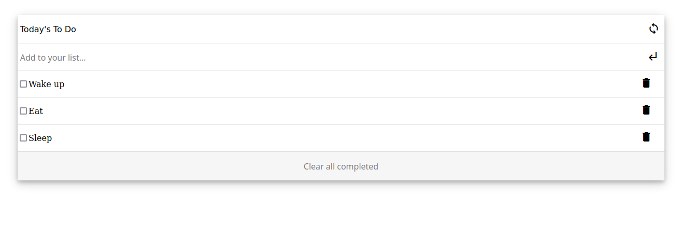

# To do list

> Created a To-do-list using Javascript classes, dynamic modals and Object orientated programming.

User is allowed to add,remove, edit and remove all checked tasks. All tasks are stored in Local storage.

## Built With

- HTML, CSS, Javascript
- NO Frameworks
- Object Orientated Programming

## Live Demo

[Check out the Live Demo!](https://lockless404.github.io/To-do-list/)

## Getting Started

To get a local copy up and running in your machine:

    1.Clone this repo or download the zip folder:

      git clone https://github.com/Lockless404/Portfolio.git

    2.Navigate to the location of the folder in your machine:

      you@your-Pc-name:~$ cd <folder>

## Authors

👤 **Hamza Tarar**

- GitHub: [@Lockless404](https://github.com/Lockless404)
- Twitter: [@hamza_tarar10](https://twitter.com/hamza_tarar10)
- LinkedIn: [Hamza Tarar](https://www.linkedin.com/in/hamza-tarar-639685216/)

## 🤝 Contributing

Contributions, issues, and feature requests are welcome!

Feel free to check the [issues page](../../issues/).

## Show your support

Give a ⭐️ if you like this project!

## 📝 License

This project is [MIT](./MIT.md) licensed.
